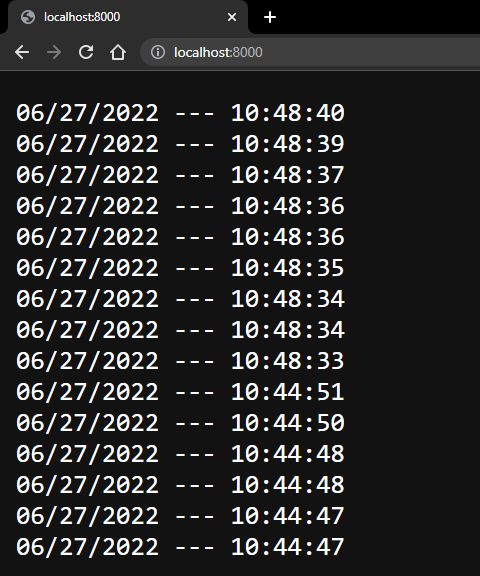

# Lab-4 Docker-compose


## 1. Основное приложение
Это джанго-приложение, которое приобнолении страницы записывает в базу данных текущее время. После чего выводит из БД последние 15 записей.


## 2. Dockerfile для приложения
```
FROM python:3
ENV PYTHONDONTWRITEBYTECODE=1
ENV PYTHONUNBUFFERED=1
WORKDIR /code
COPY requirements.txt /code/
RUN pip install -r requirements.txt
COPY . /code/
```

## 3. Docker-compose для приложения и базы данных
Использовалась PostgreSQL. Для того чтобы после перезапуска контейнера данные записанные в БД сохранились, прописываем volume, где первый аргумент "/data" - это внешнее хранилище с данными из БД, а "/var/lib/postgresql/data" - это путь к этим данным внутри образа. Таким образом, образ исползует внешние данные, которые не будут уничтожены после свертывания контейнера.
```
version: "3.9"
   
services:
  db:
    image: postgres
    volumes:
      - /data:/var/lib/postgresql/data
    environment:
      - POSTGRES_DB=postgres
      - POSTGRES_USER=postgres
      - POSTGRES_PASSWORD=postgres
  web:
    build: .
    command: bash -c "python lab4/manage.py migrate && python lab4/manage.py runserver 0.0.0.0:8000"
    ports:
      - "8000:8000"
    environment:
      - POSTGRES_NAME=postgres
      - POSTGRES_USER=postgres
      - POSTGRES_PASSWORD=postgres
    depends_on:
      - db
```


## 4. Результат
В итоге получилось два контейнера, которые работают в одной сети. Приложение записывает в БД данные, после чего их обратно получает.

